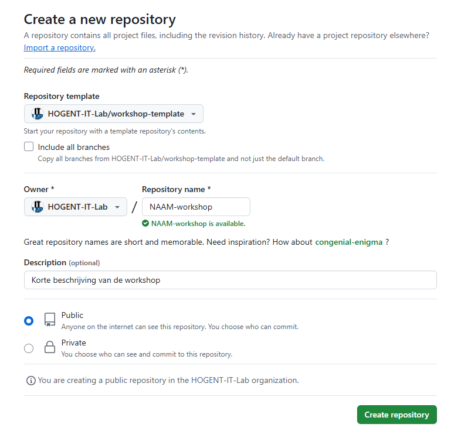
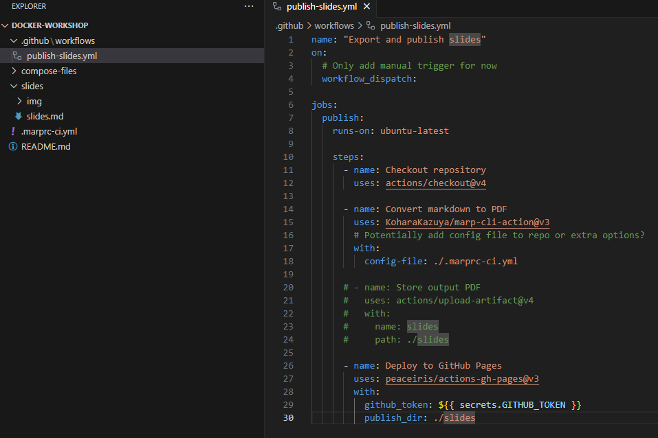
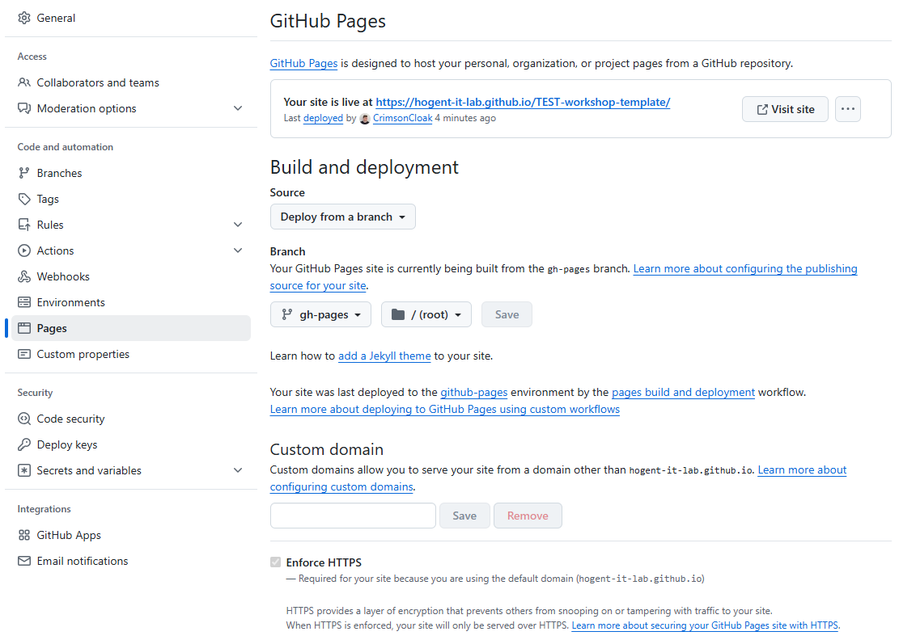

# workshop-template

Template repository voor het opzetten van slides voor de workshops van het IT-Lab

## Stappenplan

### Initialiseer en kloon een repository

1. Maak een nieuwe GitHub repository aan via de website
2. Zorg ervoor dat deze geïnitialiseerd wordt op basis van deze template-repository



3. Haal de nieuwe repository lokaal binnen via `git clone`

### Configuratie repository

Je voert best al deze stappen uit zonder te pushen (lokaal committen mag wel). Op het einde kan je dan de wijzigingen eenmalig pushen, waarna de website gebouwd zou moeten worden.

#### Slides

De slides bevinden zich in het bestand `slides.md`. Pas de templated slides naar hartelust aan en customize wat je nodig hebt voor de workshop! De afbeeldingen horen thuis in de `slides/img` subfolder - check de aanwezige slides om de correcte verwijzingen hiernaar te vinden.

#### GitHub Workflow activeren - local repository

Om de GitHub workflow te activeren die de site vanzelf bouwt op een push naar de main, onderneem je de volgende stappen:

1. Maak een `.github` directory aan in de root van de repository
2. Maak hierin een `workflows` directory aan
3. Maak hierin een `publish-slides.yml` bestand aan
4. Zet hierin de onderstaande yml-inhoud


```yml
name: "Export and publish slides"
on:
  # Only add manual trigger for now
  workflow_dispatch:

jobs:
  publish:
    runs-on: ubuntu-latest

    steps:
      - name: Checkout repository
        uses: actions/checkout@v4

      - name: Convert markdown to PDF
        uses: KoharaKazuya/marp-cli-action@v3
        # Potentially add config file to repo or extra options?
        with:
          config-file: ./.marprc-ci.yml

      # - name: Store output PDF
      #   uses: actions/upload-artifact@v4
      #   with:
      #     name: slides
      #     path: ./slides

      - name: Deploy to GitHub Pages
        uses: peaceiris/actions-gh-pages@v3
        with:
          github_token: ${{ secrets.GITHUB_TOKEN }}
          publish_dir: ./slides
```

Voorbeeld van Docker-workshop:



Push alvast de toevoeging van deze YML file en eventuele initiële changes voor de slides.


#### GitHub Workflow activeren - remote repository

##### Workflow manuel kickstarten

Ga nu naar de repository van jouw workshop via GitHub. Navigeer naar het Actions tabblad, en navigeer naar de `Export and publish slides` workflow. Eens geselecteerd, kan je hier nu klikken op `Run workflow` (gewoon op de main branch) - we gaan deze workflow eenmalig manueel kickstarten.

Na het runnen van deze workflow via de website, zal je zien dat er een nieuwe branch wordt aangemaakt - `gh-pages`. Op deze branch zitten de omgevormde slides.

##### GitHub pages correct instellen

Nu rest ons enkel nog GitHub Pages te vertellen dat hij onze nieuwe branch moet gebruiken om de slides te hosten. 

- Navigeer naar Settings
- Navigeer naar Pages
- Kies voor Deploy from a branch en selecteer de gh-pages branch 

De instellingen zouden er ongeveer zo moeten uitzien:



Na enkele minuten zal je kunnen zien op welke URL de website kan bezocht worden. Je zal echter nog `/slides` als suffix moeten meegeven.

IN het voorbeeld zoals hierboven zal ik dus moeten surfen naar https://hogent-it-lab.github.io/TEST-workshop-template/slides om mijn prachtige test-slides te aanschouwen.

#### Vervangen README.md

Eens de voorgaande stappen zijn uitgevoerd, kan je deze README.md vervangen door de README die de workshop beschrijft. Een template is beschikbaar in `README-TODO's/README_example.md`. Je kan deze file renamen naar README.md en deze plaats laten innemen - hierna verwijder je ook de gehele `README-TODO's` folder. Je kan in de README.md ook de correcte URL meegeven, of deze als website link op de landingspagina van GitHub ook instellen!

#### Optioneel but recommended - autobuild on push

Om ervoor te zorgen dat de slides automatisch gebuild en gedeployed worden wanneer je pusht naar de main branch, dan vervang je in de `publish-slides.yml` file de volgende regel toe onder het `on` keyword:

```yaml
on:
  # Add trigger on push to main branch
  push:
    branches: ["main"]
  # Add manual trigger option
  workflow_dispatch:
```

Dit zorgt ervoor dat de workflow activeert als er wordt gepusht naar main. De optie om de workflow manueel te starten wordt ook behouden, just in case.

#### Troubleshooting 

Bij issues moet je gewoon Alexander gaan lastigvallen. Check zeker ook de documentatie van MARP om de layout en werking van de slides uit te pluizen!